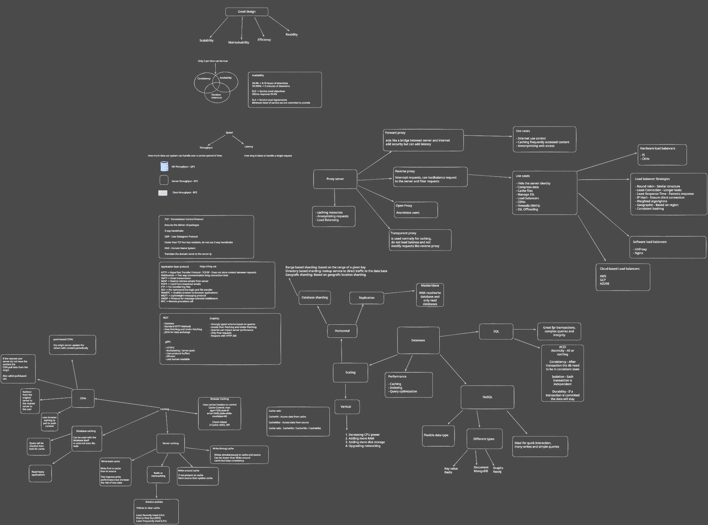

# System Design

Study about system design annotations and best practices.

## Topics & Resources

### Core Concepts

- [Foundational Concepts](./foundational-concepts.md) - Essential system design principles
- [Data Persistence Modeling](./data-persistence-modeling.md) - Database design and data modeling

### Design Patterns & Architecture

- [Design Patterns](./patterns/README.md) - Common design patterns with examples
- [SOLID Principles](./solid/README.md) - Object-oriented design principles
- [Object Calisthenics](./object-calisthenics/README.md) - Code quality practices
- [Ports and Adapters](./patterns/ports-and-adapters/README.md) - Hexagonal architecture pattern
- [CQRS Pattern](./cqrs/README.md) - Command Query Responsibility Segregation with Go example

### System Design Topics

- [Caching](./caching/README.md) - Caching strategies and patterns
- [Load Balancing](./load-balancing) - Distributing traffic across servers
- [Sharding & Replication](./sharding-replication/) - Data distribution and redundancy
- [CAP Theorem](./cap-theorem/) - Consistency, Availability, Partition tolerance tradeoffs
- [Proxies](./proxies/) - Proxy patterns and use cases
- [Scalability](./scalability/) - Scaling systems and architectural considerations

### Design Scenarios & Challenges

- [Design Scenarios](./design-scenarios/README.md) - Real-world system design challenges and solutions
  - [Twitter Challenge](./design-scenarios/twitter/twitter-challenge.md)
  - [Online Banking Challenge](./design-scenarios/banking/online-banking-challenge.md)
  - [Instagram Challenge](./design-scenarios/instagram/instagram-challenge.md)
  - [Uber Microservices Challenge](./design-scenarios/uber/microsservices-uber-challenge.md)
  - [Amazon Shopping Cart](./design-scenarios/amazon/amazon-shopping-cart-challenge.md)
  - [Netflix Challenge](./design-scenarios/netflix/netflix-challenge.md)
  - [Chat System](./design-scenarios/chat-system.md)
  - [URL Shortener](./design-scenarios/url-shartener.md)
