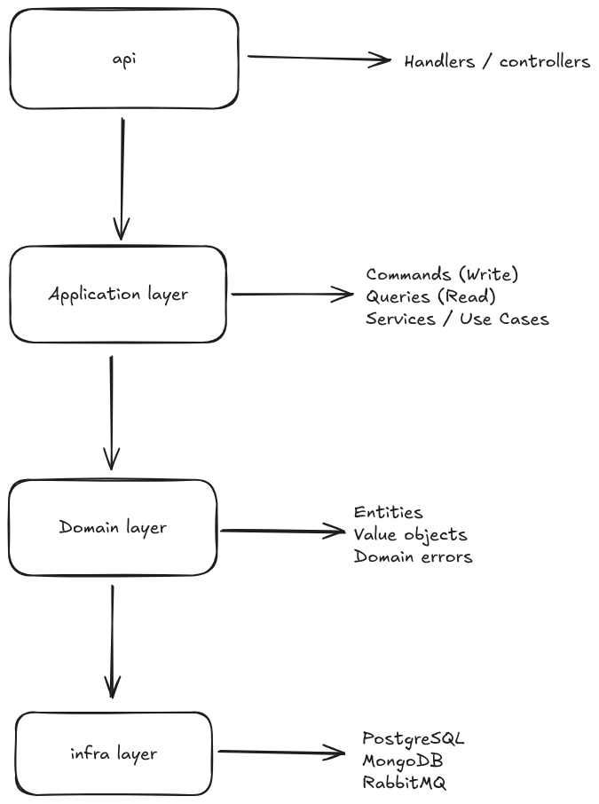

# User Service — CQRS + Hexagonal Architecture

This project is a User Service built with Go, following Hexagonal Architecture (Ports & Adapters) and CQRS principles.

It separates write and read models, integrates with PostgreSQL, MongoDB, and RabbitMQ, and supports local development without Docker for the API, while running infrastructure in containers.

## Architecture Overview



## Key Concepts

- CQRS
  - Commands -> PostgreSQL
  - Queries -> MongoDB
- Event-Driven Sync
  - Write model emits events
  - Read model is updated via RabbitMQ consumers
- Hexagonal Architecture
  - Domain is independent of frameworks
  - Infrastructure plugged via adapters
- Explicit error handling
  - Domain errors
  - Error wrapping with context
  - HTTP error mapping at boundaries

## Stack

| Component  | Technology              |
| ---------- | ----------------------- |
| Language   | Go                      |
| HTTP       | net/http                |
| Write DB   | PostgreSQL + GORM       |
| Read DB    | MongoDB                 |
| Messaging  | RabbitMQ (AMQP)         |
| Containers | Docker & Docker Compose |

## Getting Started

### Environment Variables

Create a `.env` file or copy the `.example.env`:

```env
# ===============================
# Application
# ===============================
APP_NAME=user-service
APP_ENV=development
APP_PORT=8080

# ===============================
# PostgreSQL (Write DB)
# ===============================
POSTGRES_HOST=postgres
POSTGRES_PORT=5432
POSTGRES_DB=write_db
POSTGRES_USER=user
POSTGRES_PASSWORD=password
POSTGRES_SSLMODE=disable

# ===============================
# MongoDB (Read DB)
# ===============================
MONGO_HOST=mongodb
MONGO_PORT=27017
MONGO_DB=read_db

# ===============================
# RabbitMQ
# ===============================
RABBITMQ_HOST=rabbitmq
RABBITMQ_PORT=5672
RABBITMQ_USER=guest
RABBITMQ_PASSWORD=guest
```

### Running Infrastructure Only (Recommended for Dev)

Run Postgres, MongoDB, RabbitMQ via Docker:

```
docker compose --profile infra up -d
```

Services will be available at:

- PostgreSQL -> localhost:5432
- MongoDB -> localhost:27017
- RabbitMQ UI -> http://localhost:15672

### Running the API Locally

With infra running:

```
go run ./cmd/api
```

API will start at: http://localhost:8080

### Running Everything in Docker

```
docker compose --profile infra --profile app up --build
```

### Using makefile

```
# Will up all the infra
make infra-up

# Will down all the infra
make infra-down

# Will run the api
make run

# Will run all the components
make full
```

### Generate swagger

```sh
docker run --rm   -v $(pwd):/code   ghcr.io/swaggo/swag:latest   init -g ./cmd/api/main.go -o cmd/api/docs
```

## Testing api

Create a user

```curl
curl -X POST http://localhost:8080/api/users \
  -H "Content-Type: application/json" \
  -d '{"name":"John","email":"john@email.com"}'
```

Get a user by id

```curl
curl http://localhost:8080/api/users/{id}
```
