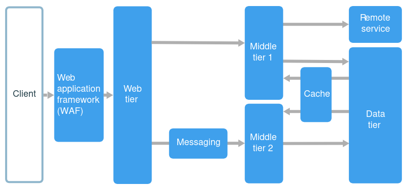

# N-Tier Architecture

## What is N-Tier Architecture?

N-tier architecture is a way of structuring applications by separating responsibilities into **layers** and deploying them into **tiers**.

Layer - logical separation of responsibilities (code organization)

Tier - physical separation (where the code runs: VM, container, server)

Example:

1. Presentation tier - UI/Frontend
2. Business tier - application logic
3. Data tier - database/storage

> "N" just means any number of tiers, not only three

## Layers vs Tiers

| Concept | Meaning                               |
| ------- | ------------------------------------- |
| Layer   | Logical separation in code            |
| Tier    | Physical separation in infrastructure |

A layer **can exist without** being a separate tier. A tier **always represents a deployment boundary**.

## Communication Rules Between Tiers

- **Strict N-tier**: Each tier only talks to the directly below it, more control, less flexibility.
- **Relaxed N-tier**: Tiers can skip layers (eg UI -> data), more flexible but higher coupling

## When Should You Use N-Tier?

Use N-tier when:

- Migrating legacy or on-premises apps to the cloud
- Working with well-known, traditional architectures
- You want clear separation of responsibilities
- You need hybrid (cloud + on-prem) compatibility

Not ideal when:

- You need fast independent deployments (microservices fit better)
- You want high autonomy per team

## Benefits - Why It’s Still Used

- Familiar and easy to understand
- Works well for incremental modernization
- Portable between cloud and on-prem
- Clear security and network boundaries
- Easier to reason about responsibilities

## Drawbacks and Trade-offs

- Extra tiers can increase latency
- Middle tiers may add little value
- Usually deployed as a monolith
- Harder to scale or deploy features independently
- More infrastructure to manage
- More tiers != better architecture

## Best Practices

### Scalability

- Use autoscaling per tier
- Scale tiers independently when possible

### Performance

- Add caching (especially near the business tier)
- Avoid unnecessary synchronous calls
- Consider async messaging between tiers

### Security

- Place each tier in its own subnet
- Restrict traffic between tiers
- Use:
  - Web Application Firewall (WAF)
  - Network Security Groups (NSGs)
  - Private endpoints where possible

## N-Tier on Azure

Common Azure components:

- Web tier -> VM Scale Set + Load Balancer
- Business tier -> VM Scale Set
- Data tier -> Managed database (Azure SQL, PostgreSQL, etc.)

Infrastructure patterns:

- One subnet per tier
- Load balancers between tiers
- Bastion or jump box for admin access
- High availability via multiple instances

## N-Tier vs Microservices

### Core Idea

N-Tier

- Application is split into layers/tiers (UI, business, data).
- Usually deployed as one system (even if spread across tiers).
- Strong focus on separation of responsibilities.

Microservices

- Application is split into independent services.
- Each service owns its business capability and data.
- Strong focus on independent deployment and scalability.

### Architectural Focus

| Aspect         | N-Tier                   | Microservices            |
| -------------- | ------------------------ | ------------------------ |
| Primary goal   | Structure and separation | Autonomy and scalability |
| Unit of design | Layer / tier             | Business capability      |
| Coupling       | Medium–high              | Low (ideally)            |
| Deployment     | Often monolithic         | Fully independent        |
| Evolution      | Slower                   | Faster                   |

### Deployment Model

N-Tier

- Tiers often deployed together
- Scaling is usually tier-based
- One release affects the whole app

Example:

- Scale web tier
- Scale business tier
- Data tier is shared

Microservices

- Each service deployed independently
- Scaling is service-based
- Small, frequent releases

Example:

Scale “Orders” without touching “Payments”

### Data Management

| Topic          | N-Tier     | Microservices        |
| -------------- | ---------- | -------------------- |
| Database       | Shared     | Database per service |
| Transactions   | ACID, easy | Distributed, complex |
| Consistency    | Strong     | Eventual (often)     |
| Schema changes | Risky      | Isolated             |

> Sharing a database between microservices breaks the model.

### Communication Style

N-Tier

- Mostly synchronous
- Usually internal calls
- Low network complexity

Microservices

- HTTP, gRPC, messaging
- Sync + async
- Network is part of the system design
- Microservices must assume partial failures.

### Complexity

| Area           | N-Tier      | Microservices                   |
| -------------- | ----------- | ------------------------------- |
| Infrastructure | Simple      | Complex                         |
| Monitoring     | Simple      | Distributed tracing needed      |
| Testing        | Easier      | Harder (contracts, integration) |
| DevOps         | Basic CI/CD | Advanced CI/CD                  |
| Networking     | Simple      | Complex                         |

> Microservices shift complexity from code to infrastructure.

### Team Organization

N-Tier

- Teams organized by technical layers
- Strong coupling between teams

Microservices

- Teams organized by business domains
- Teams own services end-to-end

### Security

| Security         | N-Tier      | Microservices |
| ---------------- | ----------- | ------------- |
| Network rules    | Few         | Many          |
| Auth             | Centralized | Distributed   |
| Zero Trust       | Rare        | Common        |
| Service identity | Not needed  | Mandatory     |
