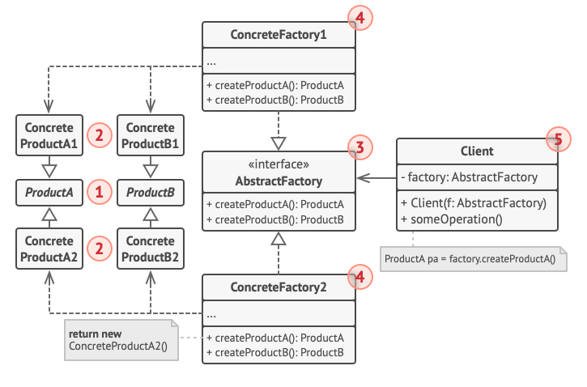

# Abstract Factory

PT BR

 

O <b>Abstract Factory</b> é um padrão de projeot criacional que permite que você produza famílias de objetos relacionados sem ter que especificar suas classes concretas.

<h2>Problema</h2>

Imagine que você está criando um simulador de loja de mobílias. Seu código consiste de classes que representam:

<ol>
  <li>Uma familia de produtos relacionados, como: 
    <code>Cadeira</code> + <code>Sofá</code> + <code>Mesa de centro</code>
  </li>
  <li>
    Várias variantes dessa família. Por exemplo, produtos <code>Cadeira</code> + <code> Sofá</code> + <code>Mesa de centro</code> estão disponíveis nessas variantes: 
    <code>Moderno</code>, <code>Vitoriano</code> e <code>Arte e decoração</code>
  </li>
</ol>

Você precisa de um jeito criar objetos de mobília individuais para que eles combinem com outros.

E ainda, você não quer mudar o código existente quando adiciona novos produtos ou famílias de produtos ao programa. Os vendedores de mobílias atualizam seus catálogos com frequência e você não vair querer mudar o código base cada vez que isso acontecer.

<h2>Solução</h2>

A primeira coisa que o padrão Abstract Factory sugere é declarar explicitamente interfaces para cada produto distinto da família de produtos (ex: cadeira, sofá ou mesa de centro). Então você pode fazer todas as variantes dos produtos seguirem essas interfaces. Por exemplo, todas as variantes de cadeira podem implementar a interface <code>Cadeira</code>; todas as variantes de mesa de centro irão implementar a interface da mesma e assim por diante.

O próximo passo é declarar a abstract factory - uma interface com uma lista de métodos de criação para todos os produtos que fazem parte da família de produtos. Esses métodos devem retornar tipos abstratos de produtos representados pelas interfaces que extraímos antes.

O cliente não deveria se importar com a clsse concreta da fábrica com a qual está trabalhando.

Outro ponto importante, se o cliente está exposto apenas às interfaces abstratas, o que realmente cria objetos fábrica então? Geralmente, o programa cria um objeto fábrica concreto no estágio de inicialização. Antes disso, o programa deve selecionar o tipo de fábrica dependendo da configuração ou definições de ambiente.

<h2>Estrutura</h2>

<ol>
  <li><strong>Produtos Abstratos</strong> declaram interfaces para um conjunto de produtos distintos mas relacionados que fazem parte de uma família de produtos.</li>
  <li><strong>Produtos Concretos</strong> são várias implementações de produtos abstratos, agrupados por variantes. Cada produto abstrato deve ser implementado em todas as variantes dadas.</li>
  <li>A interface<strong>Abstract Factory</strong> declara um conjunto de métodos para criação de cada um dos produtos abstratos.</li>
  <li><strong>Concrete Factories</strong> implementam métodos de criação da abstract factory. Cada concrete factory corresponde a uma variante especifica de produtos e cria apenas aquelas variantes de produto</li>
  <li>Embora concrete factories instanciam produtos concretos, assinaturas dos seus métodos de criação devem retornar produtos <i>abstratos</i> correspondentes. Dessa forma o código cliente que usa uma fábrica não fica ligada a variante específica do produto que ele pegou de uma fábrica. O Cliente pode trabalhar com qualquer variante de produto/fábrica concreto, desde que ele se comunique com seus objetos via interface abstrata.</li>
</ol>
  
  <h2>:zap: Aplicabilidade</h2>
  
  <strong>:bug: Use o Abstract Factgory quando seu código precisa trabalhar com diversas famílias de produtos relacionados, mas que você não quer depender de classes concretas daqueles produtos.</strong>  
  
  :zap: O Abstract Factory fornece a você uma interface para a criação de objetos de objetos de cada classe das famílias de produtos. Desde que seu código crie objetos a partir dessa interface, você não precisará se preocupar em criar uma variante errada de um produto que não coincida com produtos já criados por sua aplicação.
  - Considere implementar o Abstract Factory quando você tem uma classe com um conjunto de métodos fábrica que desfoquem sua responsabilidade principal;
  - Em um programa bem desenvolvido cada _classe_ é responsável por apenas uma coisa. Quando uma classe lida com múltiplos tipos de produto, pode valer a pena extrair seus métodos de fábrica em uma classe fábrica solitária ou uma implementação plena no Abstract Factory.
  
  <h2>Prós e contras</h2>
  
  - :heavy_check_mark: Você pode ter certeza que os produtos que você obtém de uma fábrica são compatíveis entre si.
  
  - :heavy_check_mark: Você evita um vínculo forte entre produtos concretos e o código cliente.
  
  - :heavy_check_mark: Princípio de responsabilidade única. Você pode extrair o código de criação do produto para um lugar, fazendo o código ser de fácil manutenção.
   
  - :heavy_check_mark: Princípio aberto/fechado. Você pode introduzir novas variantes de produtos sem quebrar o código cliente existente.
  
  - :x: O código pode tornar-se mais complicado do que deveria ser, uma vez que muitas novas interfaces e classes são introduzidas junto com o padrão.

