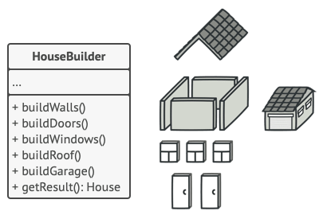
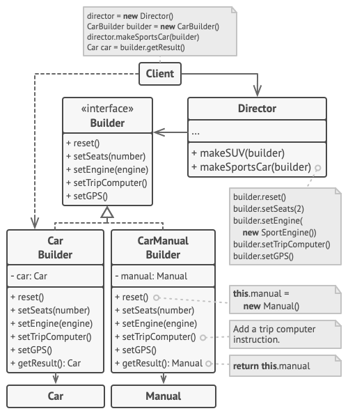

# Builder

## Intent

**Builder** is a creational design pattern that lets you construct complex objects step by step. The pattern allows you to produce different types and representations of an object using the same construction code.

## Problem

A complex object that requires laborious, step-by-step initialization of many fields and nested objects. Such initialization code is usually buried inside a monstrous constructor with lots of parameters, or even worse: scattered all over the client code.

## Solution

The builder pattern suggests that you extract the object construction code out of its own class and move it to separate objects called builders.

## example

