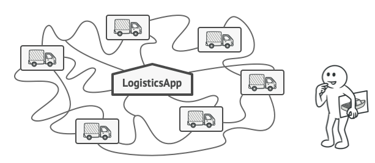
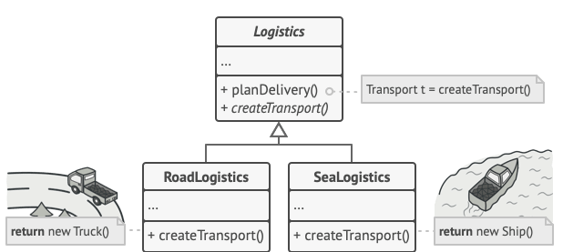
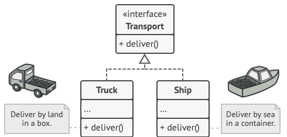

# Factory Method

> Also known as: Virtual Constructor

## Intent

**Factiry Method** is a creational design pattern that provides an interfaces for creating objects in a superclass, but allows subclasses to alter the type of objects that will be created.

## Problem

Imagine that you're creatign a logistics management application. The first version of your app can only handle transportation by trucks, so the bulk of your code lives inside the `Truck` class.

After a while, your app becomes pretty popular. Each day you receive dozens of requests from sea transportation companies to incorporate sea logistics into the app.

_Adding a new class to the program isn’t that simple if the rest of the code is already coupled to existing classes._

Great news, right? But how about the code? At present, most of your code is coupled to the `Truck` classes. Adding `Ships` into the app would require making changes to the entire codebase. Moreover, if later you decide to add another type of transportation to the app, you will probably need to make all of these changes again.

As a result, you will end up with pretty nasty code, riddled with conditionals that switch the app's behavior depending on the class transportation objects.

## Solution

The factory method pattern suggests that you replace direct object construction calls (using the `new` operator) with calls to a special _factory_ method. _Objects returned by a factory method are often referred to as products_.

_Subclasses can alter the class of objects being returned by the factory method._

At first glance, this change may look pointlees: we just moved the constructor call from one part of the program to another. However, consider this: now you can override the factory method in a subclass and change the class of products being created by the method.

There's a slight limitation though: subclasses may return different types of products only if these products have a common base class or interface. Also, the factory method in the base class should have its return type declared as this interface.

_All products must follow the same interface._

For example, both `Truck` and `Ship` classes should implement the `Transport` intreface, which declares a method called `deliver`. Each class implements this method differently: trucks deliver cargo by land, ships deliver cargo by sea. The factory method in the `RoadLogistics` class returns truck objects, whereas the factory in the `SeaLogistics` class returns ships.

The code that uses the factory method (often called the client code) doesn’t see a difference between the actual products returned by various subclasses. The client treats all the products as abstract Transport. The client knows that all transport objects are supposed to have the deliver method, but exactly how it works isn’t important to the client.

## Structure

1. The **Product** declares the interface, which is common to all objects that can be produced by the creator and its subclasses.
2. **Concrete Products** are different implementations of the product interface.
3. The **Creator** class declares the factory method that returns new product objects, it's important that the return type of this method matches the product interface. You can declare the factory method as abstract to force all subclasses to implement their own versions of the method. As an alternative, the base factory method can return some default produt type.
4. **Concrete Creators** override the base factory method so it returns a different type of product.

## :star2: Applicability

:bug: **Use the Factory Method when you don't know beforehand the exact types and dependencies of the objects your code should work with.**

:zap: The Factory Method separates product construction code from the code that actually uses the product. Therefore it’s easier to extend the product construction code independently from the rest of the code.

For example, to add a new product type to the app, you’ll only need to create a new creator subclass and override the factory method in it.

:bug: **Use the Factory Method when you want to provide users of your library or framework with a way to extend its internal components.**

:zap: inheritance is probably the easiest way to extend the default behavior of a library or framework. But how would the framework recognize that your subclass should be used instead of a standard component?

The solution is to reduce the code that constructs components across the framework into a single factory method and let anyone override this method in addition to extending the component itself.

:bug: **Use the Factory Method when you want to save system resources by reusing existing objects instead of rebuilding them each time.**

:zap: You often experience this need when dealing with large, resource-intensive objects such as database connections, file systems, and network resources.

## Pros and Cons

- :heavy_check_mark: You avoid tight coupling between the creator and the concrete products.
- :heavy_check_mark: Single Responsibility Principle. You can move the product creation code into one place in the program, making the code easier to support.
- :heavy_check_mark: Open/Closed Principle. You can introduce new types of products into the program without breaking existing client code.
- :heavy_multiplication_x: The code may become more complicated since you need to introduce a lot of new subclasses to implement the pattern. The best case scneario is when you're introducing the pattern into an existing hierarchy of creator classes.
