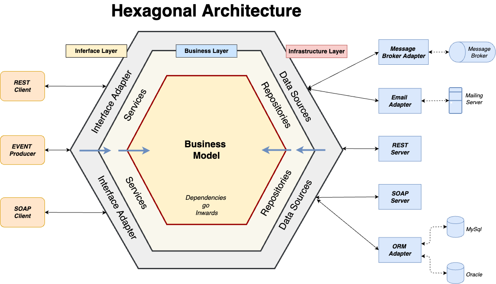

# Hexagonal Architecture

Created by Alistair Cockburn in 2005. Its main goal is to make applications independent from external technologies, such as frameworks, databases, UI, or external services.

The core idea is to isolate business logic so it can be executed and tested without depending on specific technical details.

## 1) Core concepts

- The application is represented as hexagon, symbolizing a central core with multiple well defined interaction points.
- The hexagon shape itself is not important; it's just a visual metaphor.
- The inside of the hexagon contains only business logic, completely free of technical or infrastructural concerns.

## 2) Main elements

### The Hexagon (Application Core)

- Contains the domain and business rules
- Is technology-agnostic
- Does not depend on frameworks, databases, or delivery mechanisms

### Actors

- External entities that interact with the application
- Driver actors (primary): initiate actions. Examples: users, UI, REST APIs, automated tests, other systems.
- Driven actors (secondary): are used by the application. Examples databases, message brokers, email services, external APIs

### Ports

- Ports are interfaces that define how the application communicates with the outside world.
- Driver Ports (Inbound Ports)
  - Expose application use cases
  - Define what the application can do
- Drive Ports (Outbound Ports)
  - Define services the application needs
  - Abstract external dependencies

> Ports belong to the application core, not the infrastructure

### Adapters

- Adapters are implementations that connect real technologies to the ports.
- Driver Adapters (Inbound Adapters)
  - Translate external input into calls to driver ports
  - Examples: REST controllers, CLI handlers, test drivers
- Driven Adapters (Outbound Adapters) - Implement driven ports using concrete technologies - Examples: SQL repositories, email providers, external APIs

This separation allows the core to remain unchanged even if technologies change

## 3) Configurable Dependency (Dependency Inversion)

- The application defines the interfaces (Ports)
- The adapters implement those interfaces
- Dependencies always point inward, toward the core

This enables

- Dependency injection
- Easy replacement of technologies
- High testability using mocks or stubs

## 4) Symmetry and Asymmetry

- Symmetry: All adapters depend on the application core, never the other way around
- Asymmetry: Although the dependency rule is the same, inbound and outbound sides behave differently (drives call the app, the app calls driven services)

## 5) Common Misconceptions

- It is not a traditional layered architecture
- The number of sides in the hexagon has no technical meaning
- Ports are not external components, they are part of the application core

## 6) Advantages and Disadvantages

- Benefits
  - High testability (business logic can be tested in isolation)
  - Strong separation of concerns
  - Easy technology replacement
  - Long-term maintainability
  - Business logic evolves independently of infrastructure
- Drawbacks
  - Increased architectural complexity
  - More modules and abstractions
  - Potentially longer build times
  - Additional indirection layers
