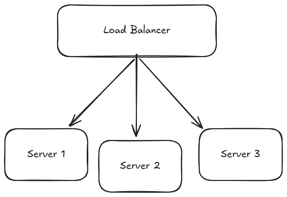
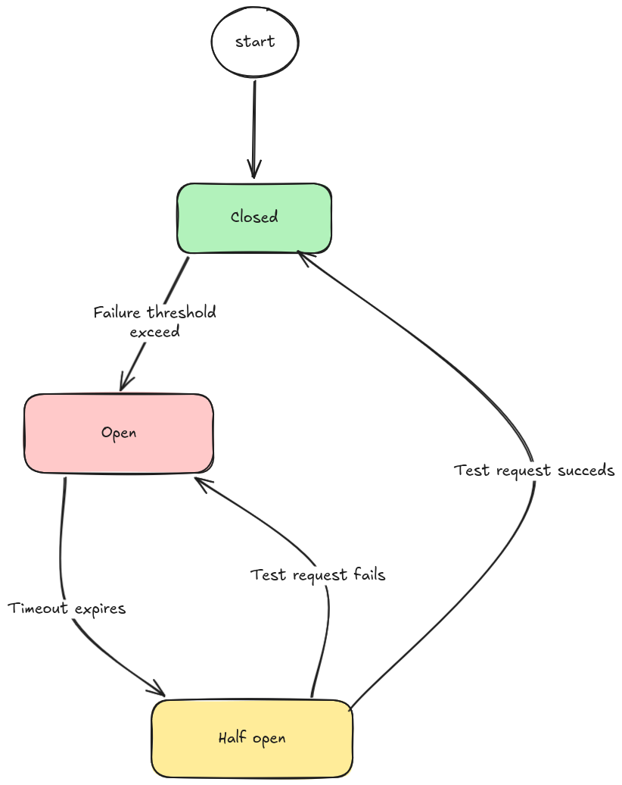
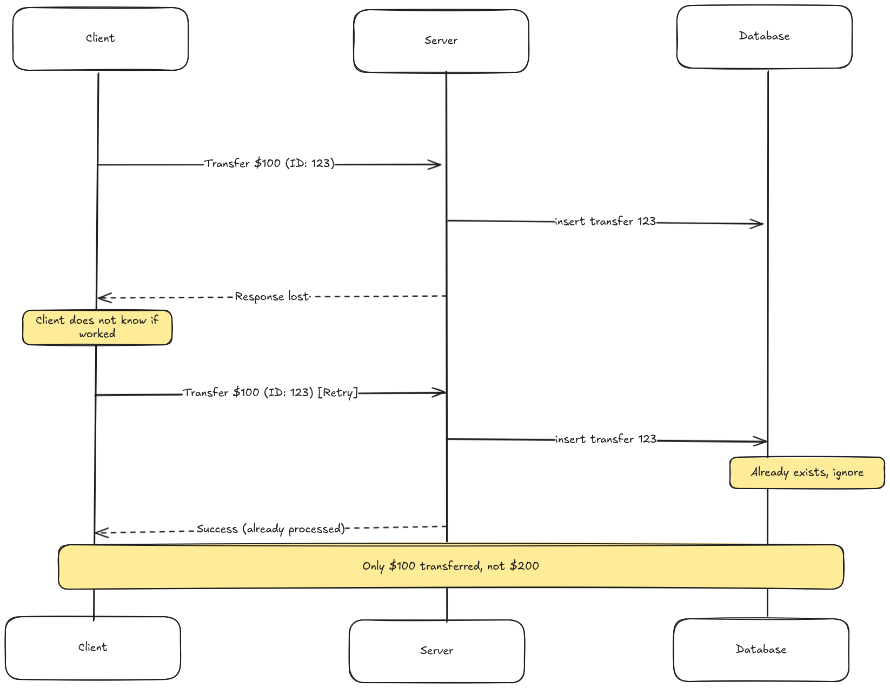

# Reliability

A reliable system performs its intended function correctly and consistently, even in the face of faults. While availability asks "Is the system up?", reliability asks "Is the system doing what it should?"

Reliability is the probability that a system will perform its intended function correctly over a given period of time, under specified conditions.

## Measuring Reliability

### 1. Mean Time Between Failures (MTBF)

MTBF measures the average time between failures. A higher MTBF means failures are less frequent.

`MTBF = Total Operating Time / Number of Failures`

### 2. Mean Time To Recovery (MTTR)

MTTR measures how long it takes to restore the system after a failure. A lower MTTR means faster recovery.

`MTTR = Total Downtime / Number of Failures`

### 3. Error Rate

Percentage of requests that result in errors.

`Error Rate = Failed Requests / Total Requests * 100%`

### 4. Data Correctness

Percentage of responses that contain correct data.

```
Correctness = Correct Responses / Total Responses × 100%
```

This is the often-overlooked metric. A system can have 99.99% availability and 0.01% error rate, but if 1% of successful responses contain wrong data, you have a reliability problem. Users received a response, it just was not the right one.

## Why Systems Become Unreliable

## Key Principles of Reliable Systems

### Redundancy

Redundancy means having backup components that can take over when primary components fail.

### Failover

Failover is the process by which a system automatically switches to a redundant or standby component when a failure is detected. This ensures continuous operation without noticeable disruption to users.

### Load Balancing

Load balancing distributes incoming traffic across multiple servers. This not only improves performance but also prevents any single server from becoming a single point of failure.

### Monitoring and Alerting

A reliable system is constantly monitored. Tools and dashboards track system health and performance, while alerting mechanisms notify engineers of issues before they escalate into major problems.

## Techniques to Enhance Reliability

The most fundamental reliability technique is having more components than you need. If one fails, others continue operating.

### 1. Redundant Architectures

The most fundamental reliability technique is having more components than you need. If one fails, others continue operating.

For example, if you have a web server handling user requests, deploy several servers behind a load balancer:



### 2. Data Replication

Ensure your data is not stored in a single location. Use data replication strategies across multiple databases or data centers.


This way, if one database fails, the system can still access a copy from another location.

### 3. Graceful Degradation

When parts of the system fail, graceful degradation keeps the core functionality working. Instead of complete failure, the system provides reduced service.


Consider an e-commerce site:

- Full service: Personalized recommendations, real-time inventory, all payment options
- Partial service: Generic recommendations, cached inventory, primary payment options
- Core only: Browse products, checkout with basic payment
- Emergency mode: Display cached product pages, accept orders for later processing

### 4. Circuit Breaker

In a microservices architecture, one service failing can cascade failures throughout the system. Circuit breakers detect when a service is failing and temporarily cut off requests to prevent overload, allowing the system to recover gracefully.



### 5. Idempotency

Network failures make it unclear whether a request succeeded or failed. If you retry, you might execute the operation twice. Idempotent operations produce the same result regardless of how many times they are executed.



The idempotency key (123) allows the server to detect retries. The first execution stores the key. Subsequent executions with the same key return the stored result without re-executing.

Stripe, PayPal, and other payment processors require idempotency keys for money-moving operations. Without them, network issues could cause duplicate charges.

## References

- [Reliability | System Design - AlgoMaster.io](https://algomaster.io/learn/system-design/reliability)
- [Availability | System Design - AlgoMaster.io](https://algomaster.io/learn/system-design/availability)
